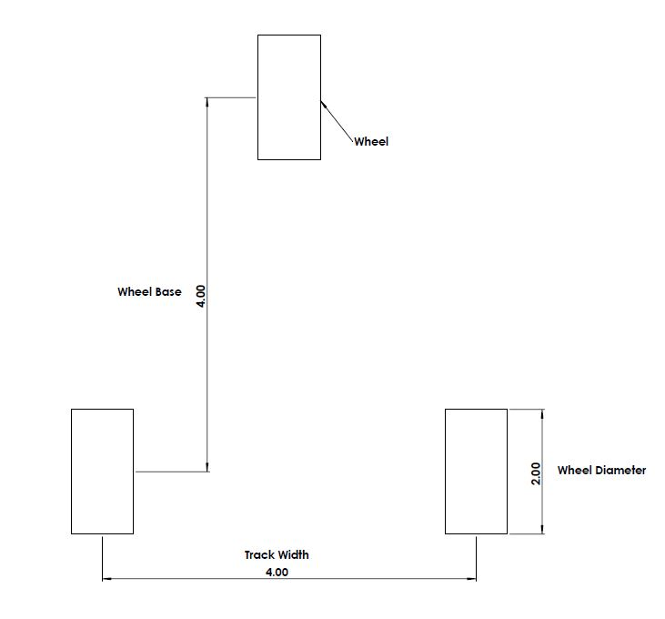

# 808XMidterm
[](https://travis-ci.com/zzimits/808XMidterm)
[](https://coveralls.io/github/zzimits/808XMidterm?branch=master)
[](https://opensource.org/licenses/MIT)


## Overview

Controller design for a three wheeled robot. The controller takes in a desired heading and a current heading and outputs the steering angle and rear wheel velocities necessary to move into the new orientation. A figure for the robot can be seen below. The dimensions for wheel base track width and wheel diameter can be in any dimension without effecting the code as long as they are all the same unit and the velocity is given as the unit over seconds. For example if they are in inches then velocity should be given as inches per second. The wheel speeds are in terms of revolutions per second. The orientation is represented by an degrees from 0 to 360. 

The code was developed by Niket Shah (GitHub: (https://github.com/s-niket)) and Zachary Zimits (GitHub: (https://github.com/zzimits)) using Test Driven Development. 

 

The robot is initilized as a member of the vehicle class which takes a wheel diameter, steering angle constrain, track width, and wheel base as constructor inputs. As part of the constructor an instance of the controller class is created for the robot with the same inputs for its constructor. The program then asks the user for a desired velocity and orientation. The program then enters a while loop until the desired orientation and velocity are reached. In the loop the function continues to call the update function for the robot. The update function initially calls the compute function of the controller class to update the wheel speeds and steering angle. The first step of this process is to adjust the vehicle speed based on the acceleration factor. Because there are no specificiations for the motors or any geartrains that may be present on the robot the acceleration has been modeled as a scalar that is added or subtracted to the current velocity to reach the desired velocity. After a new velocity has been calculated the controller looks at the difference between the desired orientation and the current orientation to decide on a steering angle. Once a steering angle is deterined the turning radius is calculated and the individual wheelspeeds are calculated to ensure that there is no wheel spin on either or the wheels. At this point the compute function finishes and returns the steering angle. Next the vehicle updates its current velocity and then integrates the velocity to find a distance travelled along the path to find the change in orientation. The new values will be tested against the loop conditions and either the vehicle will rerun the update function or the program will end.

Because of the way steering angle is calculated the vehicle is never able to reach zero steady state error. As the delta between current orientation and desired orientation decreases so does the steering angle in turn creating a larger turing radius. To eliminate this error a control agorithm such as PID could be added to account for this. After each update of the vehicle the program prints the current orientation and velocity. The demo of the code is shown below.

Please enter the desired orientation: 14
Please enter the desired velocity: 5 <br />
Current Orientation: 1.50401 Current Velocity: 2.1 <br />
Current Orientation: 3.64118 Current Velocity: 3.2 <br />
Current Orientation: 6.31828 Current Velocity: 4.3 <br />
Current Orientation: 9.11605 Current Velocity: 5 <br />
Current Orientation: 11.6235 Current Velocity: 5 <br />
Current Orientation: 13.949 Current Velocity: 5 <br />
The desired orientation and velocity is achieved!

## Product Backlog
https://docs.google.com/spreadsheets/d/1Py2qpyGfDeVT_eRLimAQFqMv2-7tjFeGuS7VBzTc-MU/edit?usp=sharing

Week 1:
Driver: Niket Shah (GitHub username: s-niket)
Naviagtor: Zachary Zimits (GitHub username: zzimits)

Week 2:
Driver: Zachary Zimits (GitHub username: zzimits)
Navigator: Niket Shah (GitHub username: s-niket)

## Standard install via command-line
```
git clone --recursive https://github.com/s-niket/808XMidterm/tree/GMock_Extra_Credit.git
cd <path to repository>
mkdir build
cd build
cmake ..
make
Run tests: ./test/cpp-test
Run program: ./app/shell-app
```

## Building for code coverage (for assignments beginning in Week 4)
```
sudo apt-get install lcov
cmake -D COVERAGE=ON -D CMAKE_BUILD_TYPE=Debug ../
make
make code_coverage
```
This generates a index.html page in the build/coverage sub-directory that can be viewed locally in a web browser.

## Working with Eclipse IDE ##

## Installation

In your Eclipse workspace directory (or create a new one), checkout the repo (and submodules)
```
mkdir -p ~/workspace
cd ~/workspace
git clone --recursive https://github.com/s-niket/808XMidterm/tree/GMock_Extra_Credit.git
```

In your work directory, use cmake to create an Eclipse project for an [out-of-source build] of cpp-boilerplate

```
cd ~/workspace
mkdir -p boilerplate-eclipse
cd boilerplate-eclipse
cmake -G "Eclipse CDT4 - Unix Makefiles" -D CMAKE_BUILD_TYPE=Debug -D CMAKE_ECLIPSE_VERSION=4.7.0 -D CMAKE_CXX_COMPILER_ARG1=-std=c++14 ../808XMidterm/
```

## Import

Open Eclipse, go to File -> Import -> General -> Existing Projects into Workspace -> 
Select "boilerplate-eclipse" directory created previously as root directory -> Finish

# Edit

Source files may be edited under the "[Source Directory]" label in the Project Explorer.


## Build

To build the project, in Eclipse, unfold boilerplate-eclipse project in Project Explorer,
unfold Build Targets, double click on "all" to build all projects.

## Run

1. In Eclipse, right click on the boilerplate-eclipse in Project Explorer,
select Run As -> Local C/C++ Application

2. Choose the binaries to run (e.g. shell-app, cpp-test for unit testing)

## Cppcheck
```
cppcheck */*.cpp
cppcheck */*.hpp
```
## Cpplint

```
cpplint */*.cpp
cpplint */*.hpp
```

## Doxygen
```
sudo apt-get install doxygen
cd <path to repository>
doxygen -g <file-name>
doxygen <file-name>
```

## License

This software is licensed under the MIT license.

## Google Mock Testing

To implement GMock testing (https://github.com/abseil/googletest/blob/master/googlemock/README.md), a new class was made named Dimensions. Class Vehicle uses method of class Dimension and thus unit testing cannot be performed by testing methods of each class individually. A mock class of class Dimensions was utilized for testing class Vehicle's methods. The object of the mock class was passed to the Vehicle class' object and the test cases were implemented. The dependencies needed for mock testing: Copy folder vendor/ (https://github.com/mlapin/libsdca/tree/master/vendor) into your repository and also make changes in the CMakeLists to add gmock dependencies. 
